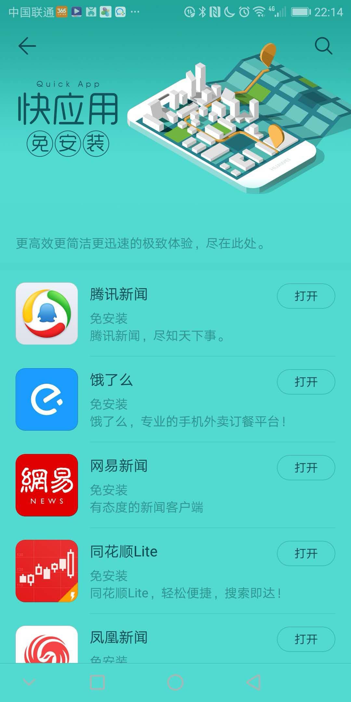
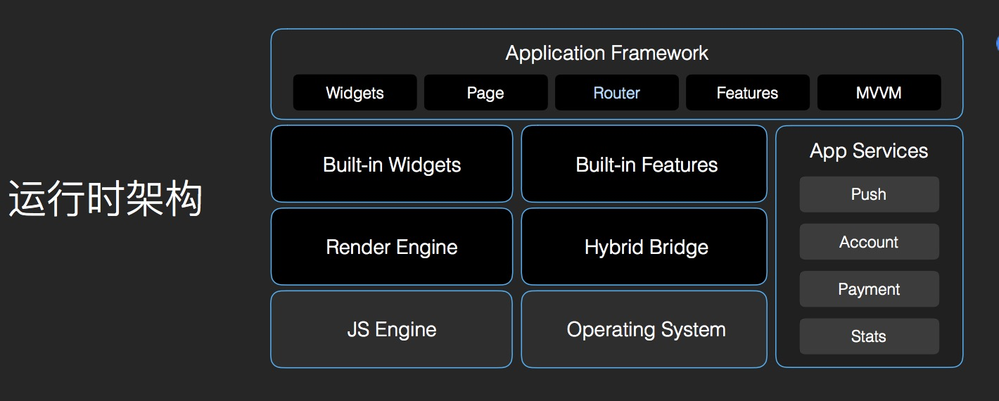

## Start

3.20 ？ 十大手机厂商 ？北京中国大饭店 ？快应用标准启动发布会？

## What ?

快应用是移动互联网新型应用生态，由十大厂商联合推出与手机系统深度整合，为用户提供更加场景化的体验。

什么？ 说人话好不好？  ～～～类似小程序，但是更骚气（开放）！

卧槽，又是新东西？**“快应用”也叫免安装应用。**实质上它并非新鲜事物，类似于微信的小程序、小米的“直达服务”、魅族的“快捷应用”，用户不用安装应用，即点即用

### 特点？

（1）包体小，无需下载、即点即用； 无需下载绝逼是扯淡

（2）覆盖10亿设备 - 用户量级巨大； 

（3）更多的应用场景，比如全局搜索、负一屏等场景的应用 

## 快应用”的优势

- **厂商丰富的流量支持，去中心化，更短路径，快速打造用户体验闭环**
- **高效链接用户,低成本助力，流量高转化，厂家丰富，强留存用户，容易生存**
- 同样使用前端技术栈，同样具备 HTML 5 与 Native App 的双重优势

## 客观评价：

- 快应用在入口层面上比小程序会少一步，或者几乎差不多（ios/android有差异）
- 在高频／社交属性强的产品中快应用相对于小程序而言并不占优势（社交／账户体系等），快应用比较适合于工具类，单一的业务场景

## 尝尝鲜？

快应用具有灵巧轻便的特点，可在应用商店、`浏览器`、全局搜索、负一屏等位置推广，各厂商快应用入口不同，具体位置请在手机端查看. 官方宣称：覆盖10亿设备，国内的主流品牌手机已支持快应用框架

## Why?

竞争？ 入口？ 手机桌面

微信上线小程序和通过应用市场进行发包没什么本质区别，分发市场。

`手机厂商为此不仅失去了应用分发的价值，也被截断了预装和广告营销的红利`

## Where ?

where

- 快应用在入口层面上比小程序会少一步，或者几乎差不多（ios/android有差异）
- 在高频／社交属性强的产品中快应用相对于小程序而言并不占优势（社交／账户体系等），快应用比较适合于工具类，单一的业务场景

## 对比

- 小程序（轻应用）
- 快应用
- pwa
- ​

### 技术

类vue／weex 技术体系，前端技术开发，实际渲染为native，`请打开安卓边界查看快应用`

### 解读

- Widgets =>框架提供等组件 基础组件(span/text/image) ／容器组件／表单...
- Page/router => 对应我们的页面，对应manifest.json => router.pages
- Features =>  系统特性服务／请求 ,fetch/file/geolocation ,项目中用到等需要在manifest.json 声明

查看我们编译等build 包会发现对应的都是js文件，粗略看下，会把template/css/ 做解析映射成以json形式记录下来，js逻辑以object 实行导出，template /css => render  ， js => JS Engine /Hybrid Bridge,

## 项目结构（框架）

- 应用配置文件，manifest.json ，权限，路由，ui相关
- 页面／组件  =>类vue 等风格（或者几乎一样） => 单文件组件 or  view/style/js拆分，不同点.vue/.ux, 引入子组件方式不同,vue => 作为component : componentA, ux => < import name>，共同点只能一个根节点
- temlate 中等节点／容器组件，基础组件／自定义组件
- style 样式 => css阉割版，阉割版，阉割版，和rn／小程序差不多，唯一的卖点在于适配，按照基准既定宽度开发，系统级适配，web viewport ? 而小程序提供rpx 存在适配误差
- script => export object => 和vue 一样喽，es6

## 组件

- 组件....看文档，并且文档有缺陷
- 事件，事件绑定 oneventType=handler , @eventType=handler, 通信 => 发布／订阅 emit/on

## 接口（系统能力）

- 基本接口（获取应用信息／路由相关／弹框/网络请求）
- 分享， 直接调用系统分享
- 打开webview，组件a 也可以实现
- 通知消息(notification)
- 震动（⏰）
- 存储（storage/file)
- 系统能力（二维码扫描／传感器／剪切板／地理位置／桌面图标／日历事件／网络状态／设备信息／屏幕亮度／音量／电量信息／录音／图形图像／音频）
- 应用管理～单独拿出来说，可以检测应用是否存在，可以安装原生应用
- 密码算法，支持rsa等加解密
- 厂商服务（推送／支付／统计／账号）
- 第三方服务（微信支付／支付宝支付／第三方分享），系统提供wxpay／alipay

## 开发工具

> 开发入门非常简单，难在文档并不是很详细，没有官方各个组件使用demo，而且我们习惯的css 用起来在quick 里用起来并不是那么的爽，坑很多，可以看咱们之后的demo，后续会补充坑在READEME中

- node 编译构建工具，**hap-toolkit工具**
- 调试器～一个apk（更新，调试rpk包）
- 预览版～一个apk，预览rpk 应用
- 可以额外安装less-loader,让style lang="less"支持less等编写
- DCloud  [HBuilderX](http://www.dcloud.io/), 支持小程序转快应用，ps： 不明觉厉
- 具体的开发细节不讲了，丢个demo 和文章链接

## 发起个讨论

小程序／快应用 / 原生／h5 的对比

| 平台／能力            | 快应用              | 小程序  | pwa   | h5   | 原生   |
| ---------------- | ---------------- | ---- | ----- | ---- | ---- |
| 系统能力             | 支持               | 部分支持 | 几乎不支持 | 不支持  | 支持   |
| 跨平台（ios/android） | 大部分安卓平台          | 支持   | 支持    | 天然支持 | 不支持  |
| 开发效率(a/b/c)      | <b               | b    | a     | a    | c    |
| 包大小限制            | 1M               | 4M   | 无限制   | 无限制  | 无限制  |
| 用户体验（a/b/c）      | b                | b    | c     | <=c  | a    |
| 开发体验（a/b/c）      | < b  ～文档／demo／社区 | b    | a     | a    | c    |
| 传播能力...          |                  |      |       |      |      |
|                  |                  |      |       |      |      |
|                  |                  |      |       |      |      |

## 参考

- [开发者文档](https://doc.quickapp.cn/)
- [快应用发布会回顾](https://www.quickapp.cn/docCenter/post/86)
- [借贷宝快应用demo一期](http://git.jdb-dev.com/mars/quickjdb/tree/master)